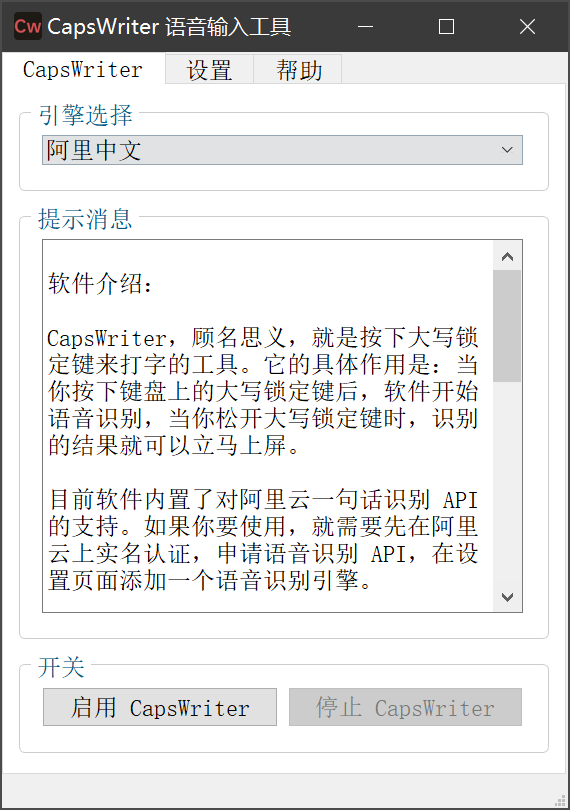
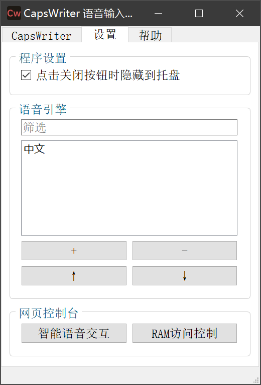

[Gitee](https://gitee.com/haujet/CapsWriter)　|　[Github](https://github.com/HaujetZhao/CapsWriter) 

#  Caps Writer

## 💡 简介

这是一款电脑端语音输入工具。顾名思义，Caps Writer 就是按下大写锁定键来打字的工具。它的具体作用是：当你长按键盘上的大写锁定键后，软件会开始语音识别，当你松开大写锁定键时，识别的结果就可以立马上屏。

对于聊天时候进行快捷输入、写代码时快速加入中文注释非常的方便。

目前软件内置了对阿里云一句话识别 API 的支持。如果你要使用，就需要先在阿里云上实名认证，申请语音识别 API，在设置页面添加一个语音识别引擎。

> 添加其它服务商的引擎也是可以做的，只是目前阿里云的引擎就够用，还没有足够的动力添加其它引擎。

具体使用效果、申请阿里云 API 的方法，可以参考我这个视频： [ CapsWriter 2.0 使用视频 ](https://www.bilibili.com/video/BV12A411p73r/) 

添加上引擎后，在主页面选择一个引擎，点击启用按钮，就可以进行语音识别了！

启用后，在实际使用中，只要按下 CapsLock 键，软件就会立刻开始录音：

* 如果只是单击 CapsLock 后松开，录音数据会立刻被删除；
* 如果按下 CapsLock 键时长超过 0.3 秒，就会开始连网进行语音识别，松开 CapsLock 键时，语音识别结果会被立刻输入。

所以你只需要按下 CapsLock 键，无需等待，就可以开始说话，因为当你按下按下 CapsLock 键的时候，程序就开始录音了，只要你按的时长超过 0.3 秒，就肯定能识别上。说完后，松开，识别结果立马上屏。

## ⭐技巧

在设置界面，将 `点击关闭按钮时隐藏到托盘` 选项勾选，就可以将软件隐藏到托盘栏运行：

### 📝 背景

对于直到 0202 年，仍然没有开发者做过一个好用的语音输入工具，我又生气又无奈，毕竟这东西不赚钱，自然没有人做。

有人建议用搜狗输入法、讯飞输入法的语音输入，但这几个方面是真让人受不了：

* 广告太多的软件，拒绝安装
* 速度慢，讯飞在手机上的语音输入挺快的，但是在 PC 上的语音识别速度超级慢
* 就以搜狗输入法为例，它的语音输入快捷键只能是`Ctrl + Shift + A/B/C……`，有以下槽点：
  * 这个快捷键会和许多软件的快捷键冲突，且不好记
  * 打字时，按这样三个快捷键，手指很别扭，不爽
* 讯飞语音输入法的快捷键是 F6，只能换成 F 功能键，离手指太远，不好够，同时和许多软件快捷键冲突

## 🔮 开箱即用

Windows 小白用户，只需要在 [Gitee Releases](https://gitee.com/haujet/CapsWriter/releases) 或 [Github Releases](https://github.com/HaujetZhao/CapsWriter/releases)  界面下载打包好的压缩文件，解压，执行里面的 exe 文件，就可以运行了，在设置界面新建引擎，填入你在阿里云中申请的：

* 拥有 **管理智能语音交互（NLS）** 权限的 **RAM访问控制** 用户的 **Accesskey Id**、**Accesskey Secret** 
* 智能语音交互语音识别项目的 **appkey** 

就可以正常使用了。

详细申请、填写 API 的步骤请到 [ CapsWriter 2.0 使用视频 ](https://www.bilibili.com/video/BV12A411p73r/) 查看视频教程。

Mac 和 Linux 用户，你们也可以使用，只是我没有 Mac 和 Linux 的电脑，无法打包。需要你们下载源代码、安装依赖库，再打包或者直接运行。

### 🛠 源代码使用

小白下载的 Release 其实是用 pyinstaller 导出的 exe 文件，如果你需要在源码基础上使用，就需要安装以下模块：

- keyboard （用于监听键盘输入）
- pyaudio （用于接收录音）
- PySide2 （图形界面框架）
- aliyun-python-sdk-core （阿里云 sdk）
- alibabacloud-nls-java-sdk （阿里云智能语音引擎 sdk）

其中：

- pyaudio 在 windows 上不是太好安装，可以先到 [这个链接](https://www.lfd.uci.edu/~gohlke/pythonlibs) 下载 pyaudio 对应版本的 whl 文件，再用 pip 安装，Mac 和 Linux 上需要先安装 port audio，才能安装上 pyaudio
- alibabacloud-nls-java-sdk 是指阿里云官方 java sdk 的 python 实现，它不是通过 pip 安装的（官方没有上传到 pypi ），而是通过 [阿里云官方文档的方法](https://www.alibabacloud.com/help/zh/doc-detail/120693.htm) 进行安装。
- 其它模块使用 pip 安装即可

本文件夹内有一个 `安装指南` 文件夹，在里面可以找到详细的安装指南，还包括了提前下载的 `alibabacloud-nls-python-sdk` 和 `pyaudio` 的 whl 文件。

## ☕ 打赏

万水千山总是情，一块几块都是情。本软件完全开源，用爱发电，如果你愿意，可以以打赏的方式支持我一下：

## 😀 交流

如果有软件方面的反馈可以提交 issues，或者加入 QQ 群：[1146626791](https://qm.qq.com/cgi-bin/qm/qr?k=DgiFh5cclAElnELH4mOxqWUBxReyEVpm&jump_from=webapi) 